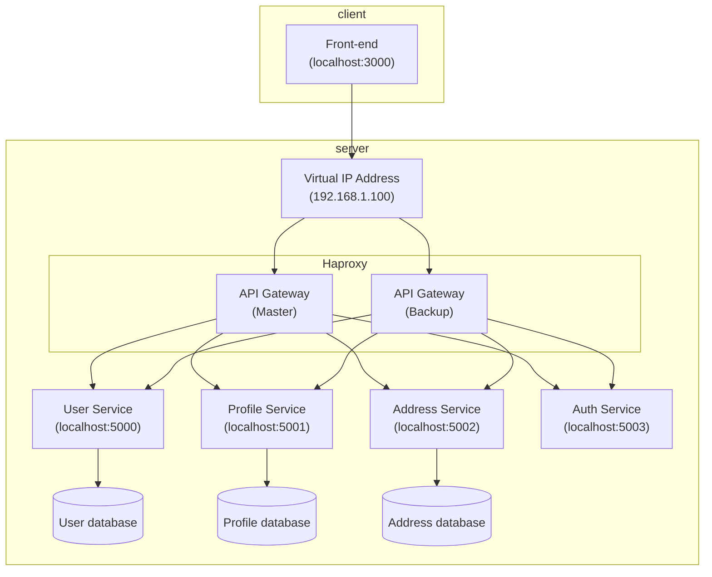

# **E-COMMERCE WEBSITE WITH MICROSERVICE ARCHITECTURE**

## **2. Overall structure**

```mermaid
graph TD
    subgraph client 
        A["Front-end
        (localhost:3000)"]
        A
    end
    
    subgraph server
        B["Virtual IP Address
        (192.168.1.100)"] 
        subgraph Haproxy 
            C["API Gateway 
            (Master)"]
            D["API Gateway 
            (Backup)"]
        end
        E["User Service
        (localhost:5000)"]
        E1[("User database")]
        F["Profile Service
        (localhost:5001)"]
        F1[("Profile database")]
        G["Address Service
        (localhost:5002)"]
        G1[("Address database")]
        J["Auth Service
        (localhost:5003)"]
        B --> C
        B --> D
        C --> E
        C --> F
        C --> G
        C --> J
        D --> E
        D --> F
        D --> G
        D --> J
        E --> E1
        F --> F1
        G --> G1
    end
    A --> B
```
